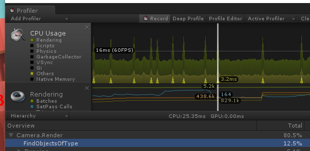
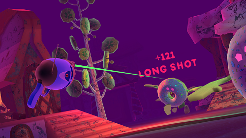

# :chart_with_upwards_trend: Optimization

Hi! So you made a great game but when you try to play it, it makes you barf. We've all made the greatest idea ever only to have the limitations of human technology rudely impede our success. Maybe your phone heats up dangerously, or maybe people are just getting sick in the headset. (Who even cares? Grow a better inner ear.)

Let's start off by establishing the basics of runtime optimization.

## The Basics

Runtime optimization is the act of honing the runtime performance so as many bottlenecks as possible are removed. A bottleneck is a performance restriction in your project - CPU, GPU, Memory, Hardware - which slows down the game enough that nothing will improve until the current bottleneck is relieved.

In other words, optimization is like peeling an onion skin by skin. If your GPU is the most serious bottleneck, a thousand optimizations to your CPU scripts isn't going to make the tiniest dent in your performance. You're essentially peeling the second or third layer of the onion before you've peeling the first. The onion is still the same size, and still just as unpleasant to eat.

You will only ever see increases in performance (framerate) upon attacking your current bottleneck - the top onion skin.

Since the most common bottlenecks are CPU and GPU bottlenecks, it's best to start there.

#### CPU or GPU?

In most cases, most of your first Unity projects will have CPU bottlenecks. GPU bottlenecks are more commonly found in complex environments with ambitious use of lighting, shading, particles, and vertices. GPU bottlenecks are also found when someone overzealously cranks various graphical options, or light ranges into insane ranges.

Typically, if you've left your quality settings more-or-less the same, and your environment is relatively normal compared to other games, you're hitting a CPU (script-based) bottleneck.

However, if you're not sure, use the Unity Profiler.

#### The Unity Profiler

Found at `Window > Profiler`, this tool is so powerful it can nearly singlehandedly be your agent for discovering heavy scripts, overutilization of components, bad run-time loading, and other peculiar things.

It keeps track of your overall framerate, as well as the makeup of each frame. It can tell you specifically which scripts are creating frame drops, so you can target a specific call. Sometimes it will confirm your own suspicions, or bring new information to light. Either way it is incredibly useful.

Here are some things to look out for in the CPU log:

1. Any spikes in the log. If it isn't a load-screen, it's probably unacceptable. Anything which spikes your fps below 90fps is particularly terrible.
2. Anything which - even if steady - takes up near to/more than 1ms of time in the stack, per frame. Typically your total budget for the entire frame is a measely 8.33ms ([see Frame Budgets](#frame-budgets)).
3. Average frames per second in different types of gameplay. Your menu and your boss battle have different performance costs.

#### Frame Budgets

Your budget is as follows depending on your target FPS. This should basically cover all your bases since nobody develops 30fps games anymore unless it's stylized or turn-based.

* 120fps = 8.33ms
* 90fps = 11.11ms
* 60fps = 16.67ms

#### The VR Price

In order to render in a binocular fashion, the game needs to render two simultaneous cameras. Additionally, your framerate is typically supposed to consistently stay above 90fps or even 120fps. 

You can think of VR as using [7x the amount of resources](https://www.pcgamesn.com/eve-valkyrie/vr-requires-a-pc-7-times-more-powerful-than-1080p-gaming-say-nvidia) as a typical 1080p 60fps game, because these factors multiply and stack upon each other.

Be prepared to cut back on visual fidelity in favour of performance. Performance is paramount.

## Noah's Hit-List

A lot of the time the best place way to start is just knowing your options. Sometimes you don't know an option exists but once you discover it you go *"Oh, yeah, that makes sense that it would help."* Sometimes we just assume we're getting something for free, when in reality everything has a cost. Lean too much on an assumption and you'll feel like an idiot when that assumption breaks.

I'll start by just throwing out ideas one by one and you can use your best judgement as to which ones to prioritize first. :sweat_smile:

### Script Loop Hitching (CPU)

I will assume in writing about loop hitching that you know the gist of Unity's Update() and FixedUpdate() loops. 

Script hitching happens when your scripts push you over the [frame budget](#frame-budgets). This is because the update loops in Unity are synchronous, and holding up one will hold up the others. To stop these performance problems from happening you should do a couple things:

1. Move as many distinct methods to distinct [asynchronous coroutines](development.md#coroutines). This will ensure that even if they do take too long to complete, they are un-bound from the synchronicity of the rest of the Unity loops.
2. In fast loops (>= 60 calls per second) small changes in how you check and assign data can help you in significant amounts. Consider using [switch-cases](https://docs.microsoft.com/en-us/dotnet/csharp/language-reference/keywords/switch) instead of a long string of if-statements, avoid using or comparing strings as much as you can, find [alternatives to runtime instantiation](#object-pooling), and simplify your math if you're doing some wild stuff.

### Physics Matrix (Helps CPU)
* Your physics matrix keeps track of how layers interact. The less check-marks the better, for physics and other collision dynamics.
`Edit > Project Settings > Physics > Layer Collision Matrix`
* Having every checkbox filled in means that everything is looking out for everything, which is silly and heavy. (UI elements don't need to collide with water dummy, unless they do in your game in which case I apologize).
* If things will never interact, we don't need to check for it

### Static Batching (Helps CPU and GPU)
* Make un-moving environmental objects 'static' by checking the static box at the top right of the inspector. This saves both on render time and computation time.

### Cut Down On Materials (Helps GPU)
* Use less materials, especially on mobile.
* Use lighter shaders, and less maps. Unity Standard Shader is very powerful, but very heavy. Consider using Legacy or Mobile class shaders. These are included in Unity by default.
* Sometimes a simpler visual aesthetic helps remove noise and business from a scene, or can enforce an aesthetic. *This can be a positive thing.*

### Optimize Your Lighting (Helps CPU and GPU, Baking can hurt Memory)

**Baked Lighting**

* If you have extra memory and a rendering bottleneck, consider baking lighting into the environment, which makes the light non-dynamic, but lightens GPU load immensely. Note: this means you lose realtime shadows.
* All items included in the bake *need to be marked 'static'* and sometimes (if they don't already have UVs) need to have the "Generate Lightmap UVs" option checked in their model's import settings.

**Realtime Lighting**

* If your light is too dim, instead of upping your light's *range*, up the *intensity*. Setting the range to 1000m  even though the light decays at the 30m mark means the light is still calculating the light for a basically-unused 970m. Super expensive. Instead increase the brightness to compensate, and take your distance down to like 40m.
* Avoid clashing dynamic lights. If two lights occupy the same space, they'll either nullify each other, or they'll use a lot of resources. This is dependent on the "Pixel Lights" setting in your Quality Settings panel. A pixel light value of 2 means 2 lights can affect the same space, but a third light will interfere with them.

### Kill Transparency (Helps GPU)

* Transparent materials are terrible and make your GPU cry. It basically has to render the same space on the screen twice. Once for what's behind and once for the translucent material.
* Because of this, some devs aim for a 'No Transparent Materials' guideline.

### Smart Fog (Helps CPU and GPU and Memory)

This is a very niche technique, but I've used it a couple times now, and it is a good heavy-handed but stylish solution to easing just about everything in your game. It works because of three things:

1. Basically, your camera has a 'far plane' where past that point, nothing is rendered. It renders through the object directly to the skybox. If you pull this wayyy in to like 30, you can only see 30 units in front of you before things become the skybox.
2. Your camera also has a 'Clear Flag' which can be set to a solid colour, or the skybox, or some other shit too. This is essentially just 'what your camera will render when it isn't rendering anything'.
3. In the `Window > Lighting` panel, there is an option at the bottom for Fog! Specifically, it lets you set the colour and the density. This will be important for when we bring it all together.

So - if you have a big environment, consider using a dense fog which hits max opacity by maybe 30 units away. Give this fog a colour which looks good. Also set your main camera's Clear Flag to the SAME solid color (matching the fog). Lastly, drop your camera's Far Plane so that it is juuust beyond the fog. This means the camera stops rendering anything after say 20m in front of you, and it still looks good. Spooky or dreamy even. I used this technique when redesigning [Zombie Donuts](https://www.virtro.ca/zombie-donuts.html).

### Culling (Hurts CPU Slightly, Helps GPU)

Culling is a broad term which describes 'not doing' something if it isn't needed. There are a couple well-defined examples and a generalized definition for what this means.

**Frustum Culling** - This is the act of not rendering anything which is outside the camera frustum. This is done by default by most if not all graphical engines. It's usually so low-level that you never need to deal with it. Seen below is an example. There is a slight CPU overhead but it ultimately pays for itself very quickly, and takes a lot of strain off the GPU.

 
 
**Occlusion Culling** - This is the act of disabling rendering for any elements which *are* in the viewing frustum, but are *behind* a solid object. It needs to be enabled by the developer as it is not optimal for all circumstances. An ideal use-case for this would be if the player is inside a small cabin in a forest. By looking at the window, we only want to render the forest which is visible in the window, but the forest which is behind the walls should remain hidden. This is what occlusion culling does.

 

However, occlusion culling is complicated. It's highly spatial math which samples from a large volume of invisible cubes as well as the camera to determine what is hidden. It can in fact hurt performance if your game isn't cutting out much, but is still doing all the calculations.

**Custom Culling** - This is the generalization of this concept, wherein you try to stop script execution, animation execution, sound emission, or any number of other things based on a criteria you see fit.

One example of this would be disabling animations which are playing in the far distance and aren't noticeable. Another example would be disabling a script which changes an object visually if the object is behind the player.

You'll want to be most careful with custum culling. Sometimes you're just not able to create a satisfactory tradeoff, and the time investment won't be worth it. I recommend really gathering some evidence from the profiler which confirms a particular thing (animation or otherwise) is taking up a significant proportion of the frame. From there, develop as light-weight a solution as possible.

### Object Pooling (Hurts Memory Slightly, Greatly Helps CPU)

Two of the most common Unity methods are incredibly expensive, namely Instantiate(GameObject) and Destroy(GameObject). Instantiation is terrible in general because it seems to hitch scripts no matter what, even if in an asynchronous loop. I haven't been able to get past this, and it seems to be in black-box territory.

One great solution to this is 'object pooling' which describes loading objects at the beginning of the app's lifetime, and activating, deactivating, and reactivating them again as needed. It's essentially object recycling. Object pooling works best on similar object types, but can be made more flexible with some smart polymorphism. Remember, your polymorphic object needs to be able to transform *back* into its parent class.

There are many ways to do this but here is a basic and effective implementation.

* Find the maximum number of instances of an object within your game.
* Spawn that many instances at the beginning of your game.
* Put them in an array which is kept by a PoolManager or LevelManager type class.
* Create a ObjectType [enumerator](development.md#enumerators) with options for each type of poolable object.
* Give the class two methods, `public GameObject Grab(ObjectType type)` and `public void Recycle(ObjectType type, GameObject objectToRecycle)`, which take and give objects to the pool.
* Call `PoolManager.Grab(ObjectType.Coin)` or `PoolManager.Recycle(ObjectType.Banana, bananaGameObject)`.

### Level of Detail (LOD) (Slight CPU Hit, Greatly Helps GPU)

If your game world is spatially large, and especially if you have complex objects, you should consider investing time in developing LOD levels for your textures and your models.

To do this, you attach an LOD Group object to your GameObject in question, and provide models each with number postfixes as so:

`ModelName_LOD0`, 
`ModelName_LOD1`, 
`ModelName_LOD2`

A detail level of 0 is your most high-quality model, and each one in addition is a lower quality. You can provide independent biases towards particular LOD levels in the Quality Settings window.

For textures you need to use a method called 'mipmapping' which is essentially a texture with downscaled variants. This can be introduced to your LOD in addition to model-swapping in order to free up texture memory.
