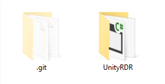

# :file_folder: Git

Git is a version control utility. It serves to give you and your team a huge advantage when it comes to:

1. Working simultaneously on the same project.
2. Working simultaneously on the same file. (With a couple stipulations.)
3. Keeping track of changes.
4. Reverting to previous versions of the project.
5. Experimenting on your project in an isolated environmemt.
6. Backing up your project.

It is perhaps the single most influential piece of software to the software development industry at large.

One uses Git alongside a service like [GitHub (Free, Public)](https://github.com) or [GitLab (Free, Private)](https://gitlab.com) interface, which you are probably (hopefully) viewing this documentation through at this very moment. Both of them have some pretty nice web features, and GitHub even has its own client. However, I'm not going to use any clients in this wiki because it oversimplifies some of the operations to the point where people struggle to find understanding. We're simply going to use the stock Git Bash commandline interface. It's reminiscent of PowerShell or the Command Prompt, but with some nice Git-specific formatting and features.

## :baby: Git Basics

### How does it work?

A Git 'repository' basically keeps record of your project in every state it has **ever** been in. The complete history is written into the repository so it can be ['pulled'](#pulling) (downloaded) in its up-to-date state, with flexible access to every previous iteration of the project within the downloaded repository. Each change to the project is saved, or ['committed'](#what-is-a-commit) to the project history.

#### What is a commit?

A commit is made by a developer and is a deliberate 'saving' of project data. However, instead of remembering the whole file or folder, it merely remembers the *changes* since the *last* commit.

This means that if you start from the beginning of the project history (typically an empty project - the first commit), and add commits one by one, the project will eventually resemble the fully up-to-date version. It also lets you move to any intermediate commit and see the project as it was part-way through development. The implications of this system are huge and insanely powerful.

Each commit is given a commit ID, which is a hashed value like `5d3e1d37588915bd58e3b7bcbd09eb47830323c7`, but is often seen forshortened to the first 8 digits, eg. `5d3e1d37`. It uniquely identifies the current state of the project at the time of the commit. 

#### Okay, so what does the repository look like on my computer?

Structurally, your repository should look like this, although the .git folder is hidden in Windows by default:



1. The .git folder keeps track of the **entire** history of the project, but isn't for direct manipulation. Instead, it **remembers** everything. Think of it like a memory bank holding the know-how to revert to any previous version of the project, and - if needed - return to the most up-to-date version.
2. The project folder is currently active portion of the repository. This is where you make changes. The .git folder enables this project folder to essentially 'jump through time', by swapping the current project commit out for older commits. If the project folder has no unsaved changes, it will let you switch the folder to match a certain committed version of the project folder.


Together, these two folders enable you to switch to or 'checkout' any previous state of the project, and then manipulate it on an active instance of your project.

A repository can have many 'branches' which are isolated streams of the project development which branched off the main branch at a certain point. For instance, a branch always has a `master` branch, which contains the stable, tested changes combined into a master build. I implore you to quickly look at how [my company handled branching](#repository-protocol), as there is a decent system to it which your director will LOVE if you use.

#### Committing + Pushing

Committing happens in two steps, and pushing is a third step which puts your commits on the online version of the repository. (The cloud.)

The first step is to add the files which you want to include in your commit. Git will not assume you want to replace the entire project every time you modify one file.
* By typing `git status` and hitting Enter at any time, Git will display all the modified files, and all new files, in red. These red files indicate they have not been added to any planned commit. They are 'unstaged' changes.
* Typing `git add -A` and hitting Enter will greenlight every red file (every modified or new file) to be included in the commit. These files will show up green if you type `git status`, and are considered 'staged' changes.
* If you want to add an individual file, just type `git add Folder/File.txt`, although if your filepath has a space in it, you need to add quotes around the path. <br>Ex. `git add "Folder/Folder With Spaces/File.txt"`
* If you added something you don't want added, use `git reset` to unstage all changes, or `git reset HEAD -- <filepath>` to unstage an individual file.

The second step is to commit the staged changes. 

* Type `git commit -m "[Message]"` and hit Enter.
* Read [how to make adequate commit messages](#scrutinize-your-commit-messages) below
* All greenlit files (marked green) will be part of this commit. Red files will be ommitted.

And finally since everything which has happened has only happened locally, we want to reflect our changes in the cloud repository, hosted on GitHub or GitLab or equivalent services.

* Type `git push` and hit Enter to reflect these changes online.
* After it pushes, other developers will be able to access the branch you just pushed to receive your changes.

#### Pulling

This is effectively the inverse of pushing. In order to receive changes from the cloud, you need to download those changes by entering `git pull`. Pulling checks the online repo for changes in every locally known branch, and should tell you if new branches have been formed.

Note: Pulling will pull the changes for the currently active local branch, not for everything. If you want to get the changes on another branch you'll need to ['checkout'](#checkout) the other branch before pulling.

#### Checkout

A checkout is the act of switching to another branch. If you have any un-committed changes you cannot checkout another existing branch.

Once all the current unstaged changes are committed or reverted, you are safe and able to switch to other branches with the `git checkout [existing-branch]` command.

Note: The checkout command can also be given a '-b' parameter to cut out all your changes to the current branch, and move them to a new destination branch with the given name.  
Ex. `git checkout -b [new-branch]`. This cleans the source branch and moves all your changes (staged or otherwise) to the newly created destination branch.

### Scrutinize Your Commit Messages

There are a few reasons to be absolutely graceful with your commit messages, including but not limited to:

1. Justifying R&D so you can obtain funding/grants.
2. Repeatability of builds. Knowing which commit to return to to make a carbon-copy of a certain build is invaluable.
3. Resolving project merge catasrophes by identifying EXACTLY which commit is causing an error.

Here is the example of a **very bad** commit message:
```PowerShell
git comit -m "fixed dumb thing with the gun"
```
A couple problems here.

1. Clarity. What was the error? What was changed?
2. Responsibility. Who made this change? Who do we smack on the head?
3. Justification. Why did they make this change? Do they have a reason for doing this?
4. They misspelled 'commit' which in this case is a **good thing** because now we can retype this commit message properly.

So, let's try this again. Your commit message should be as close to the following formatting as within reason:

```PowerShell
git commit -m "[Name] What > Where > Why - [Build number if build was submitted]"
```
Why do we use our name in the message? GitHub and GitLab force you to login anyways, so why isn't that enough? Well we switch computers constantly and it becomes too tedious and confusing to identify and change the logged in user, and their [SSH keys](#ssh-keys). Adding the text to the commit message just simplifies things greatly.

Additionally, if this was a build that was submitted to a [QA process](qa-processes) or was put live to the public, we want to make mention of the version number, and where the build was sent. In the future, it is vital that other programmers can locate and revert to your particular commit in order to carbon-copy a release build.

Examples:

```PowerShell
git commit -m "[Noah] Added a button to the options menu to delete save-data so the player can start a fresh game because players wanted their friends to try from level 1."
git commit -m "[Tony] Integrated the LocalizationManager module with a new database so there are more supported langauges in the game. - Build v1.3.7 for Oculus submission."
git commit -m "[Meri] Removed movement from the player prefab to research player behaviour in a static environment. Build v0.2.7 for Playstation user testing."
```
Do you have to follow this outlined protocol for every project? No, but in a professional environment working on an official product, this is a huge skill which multiple specialists have explained to me 'is important in the biz.'

> "This is important in the biz."

-- Guy who taught me about release management.

### Merging

The [.gitignore](.gitignore) file that should be packed into the Unity project folder will take care of the nasty Unity related merge problems that you ideally should never have to encounter. **Trust me, you'll really want this.** The alternative is adding thousands of temporary files to your repository which would normally be deleted.

(When you setup your repo open up the .gitignore and verify that it starts with `### Unity ###`, if it doesn't, replace the .gitignore file in your repository with the one in mine.)

However this doesn't make merge 100% clean, as [every file in your unity project is given a .meta file to track its references and other good stuff](#referencing-gameobjects-and-components) within the project.  
Typically you DO want to commit meta data (.meta files) along side any changes you make to the project files, so that no data or references are lost between machines. This is because the .meta files contain all the [reference IDs](development.md#reference-ids) important to linking Unity components together. Unity will automatically regenerate totally new IDs if it can't find one for a particular file. If you don't commit your .meta files, you may notice Inspector panel references disappearing.

Do the following to have a nice successful merge:

* Once your branch is ready to be implemented back into the project at large, commit your changes (using a nice succinct [commit message](#scrutinize-your-commit-messages)) and push
* Switch over to develop (using checkout) and pull to make sure that you have all recent changes to the project
* Switch back to your feature branch and type `git merge develop` and hit Enter, this will take any changes that have been made to develop since you branched off of it with your feature, and merge them with your changes (on your local feature branch)
* eg. This does NOT change anything on the `develop` branch, so any conflicts will be isolated to your branch, removing the risk of breaking the whole project
* One of two things will happen at this point:
    * Either eveything will go swimmingly and after some text scrolls down the screen, your bash line (colourful - above the blinking cursor) will end with `[branchname]`
    * **OR**
    * The bash line will end with `[branchname]|MERGING` which means that you still need to make some desicions on which changes stay and which changes are dropped
        * At that point you should ask someone experienced for help if you can, because merge conflicts are very case-by-case-complicated, and can get messy and ruin things fast (although at this point you're still contained in your local branch).
* Once the merge is completed, you can switch back to `develop` (using `git checkout`) and merge your feature branch back into it (which should now not have any issues)
* Boy, I sure wish I had this guide when I started with git :)

[If you want to see some basics on resolving conflicts yourself, click here!](#resolving-conflicts-manually)

Note at this point that all features are branched off of and merged back into `develop`; `develop` is the only branch that ever interacts with `master`.  
This ensures that `master` only ever contains good working versions of the project, which can be built for submission to stores.

## :japanese_ogre: Advanced Git

### Repository Protocol

I try to use a standardized setup in our projects - characterized by its two special branches:

#### Master branch
* The repository will by default have a master branch where *no work should ever be done.* I'm a bad boy so in the wiki-noah repo I just edit directly on master, but you won't want to do this in a field environment.
* The master branch will only be pushed to with version of the project which are ready for release, these pushes will come from the 'develop' branch.

#### Develop branch
* You will need to create this develop branch before you start working on the project.
* Once you have the repo cloned on you machine, open Git Bash in the project folder which has the .git folder. `Right Click > Git Bash Here`. Don't do this INSIDE your .git folder because it won't recognize this as a repository. 
* Type `git checkout -b develop` and hit enter to create the develop branch off of master.
* Type `git push -u origin master` and hit enter which allows your local work to be pushed back to the online repo.


### Feature/Issue Branching Methodology

I try to use Feature Branching or Issue Branching, which are terms used to describe opening branches for each individual feature or issue. Those branches are then merged to the `development branch`, where any conflicts and compatibilities are reconciled.
Issue branches should be branched off of the `develop` branch using the following procedure:

* On your Git host of choice - GitHub or GitLab - there should be an "Issues" section attached to your repo.
* Access the Issues tab and create a new issue. Once completed it should have a number associated with it.
* You can now create your new branch. GitLab even lets you do this directly from GitLab and your Issue ticket.
* Give your branch a name corrosponding to the issue or feature you're implementing. Ex. `this-wiki-sucks` formatted as in the example.
* If you want to get super fancy and professional, add the issue number to the front, i.e. `1-this-wiki-sucks`. Again, GitLab does this by default from the web interface.
* Begin work on the branch as per normal.
* When the work is finished, merge back into the `development` branch.
* Finally, if the development branch is clean, stable, and ready for a submission, merge with `master`.

### Resolving Conflicts Manually

* If you don't have a senior developer who can help you resolve a string of conflicts, the best thing to do is to type `git status`.
* This will show you every file which was modified on your branch, and every file which was modified on their branch in green.
* This will also highlight files you BOTH modified in red. There are a few ways two branches can modify the same file:

1. Both added. (You will have to choose one file or the other. Use `git checkout --ours <filepath>` or `git checkout --theirs <filepath>` to select one or the other. Then use `git add <filepath>` and hit Enter to mark this file resolved.)
2. Both deleted. (Shouldn't be an issue. Use `git add <filepath>` and hit Enter to mark this file resolved.)
3. Added by us. (Shouldn't be an issue in most circumstances. Use `git add <filepath>` and hit Enter to mark this file resolved.)
4. Added by them. (Shouldn't be an issue in most circumstances. Use `git add <filepath>` and hit Enter to mark this file resolved.)
5. Both modified. (The file will be marked up by git at this point.) Go to Visual Studio and look for markup containing the following:

```c# 
string dialogue;
<<<<<<< HEAD
// Their branch's version of code.
dialogue = "I like to eat bananas normally.";
=======
// Your branch's version of code.
dialogue = "I like to eat bananas ravenously.";
>>>>>>> feature-branch-name
```

Once you have selected which parts of the code you want to keep from BOTH branches, and you have reconciled any differences they may have had, you can go back to git bash and type `git add <filepath>` and hit Enter to mark this file resolved.

When you have vetted every file which threw a conflict, and marked them all green, tested the game successfully with no errors, and are confident it's in a good place, make a quick commit detailing your conflict resolution, and push.

Boom. Doing this right is a monumental task, and can often save hours of re-development.


