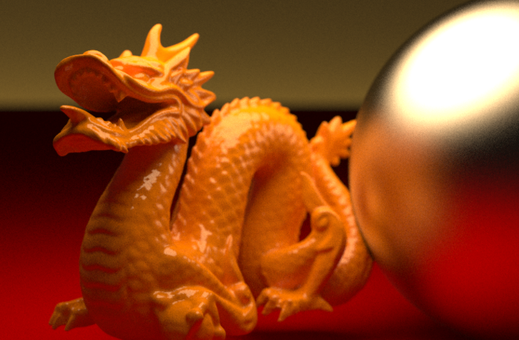

# 🐉 Shaders

Shaders are perhaps my favourite thing to code, and also among the least approachable things to code. Their effects are seen far and wide in games, and a good shader can be a thing of beauty.

  

Shaders are used to give materiality to objects, style to a project, post-processing, and any multitude of visual effects.

## 🐜 CG

(Coming Soon) What is NVidia's CG language and why is it worth learning?

## What is this? A Language For Ants?

(Coming Soon) Concerning parallel processing vs. serial processing, and why shaders use GPUs.

## Shader Structure

(Coming Soon) What does a typical shader file look like?

### Deferred vs. Forward Rendering

(Coming Soon) What are the pros and cons of these two pipes?

### Papa's Proper Use of Properties

(Coming Soon) How to define and use properties.

### Subshader? I Barely Knew Her!

(Coming Soon) What a subshader is, why you might have a few in your shader, and what they output.

### Vertex Shaders, Fragment Shaders

(Coming Soon) What a subshader is, why you might have a few in your shader, and what they output.

### Falling Back

(Coming Soon) How to make your shader fall back on other shaders if it isn't supported.

## Shading

(Coming Soon) A big section outlining lots of tools in your toolset.

### NdotL

(Coming Soon) Giving a basic light value based on the dot value of normals and light direction.

### Light Processing

(Coming Soon) Using more from your lights!

### LUTs

(Coming Soon) Look-Up Textures and what they do, plus some best use-cases for them.

### Matrix Multiplication

(Coming Soon) Talking to the camera, and how to get access to perspective in your shader code.

### Viewing Angles

(Coming Soon) Getting the angle of view of the camera, and how that might affect specularity.

## Case Studies

(Coming Soon) Sometimes the best way to learn is to just jump in!

### Cel Shading

(Coming Soon) Cel Shading, often called 'Toon Shading' and how to execute it.
